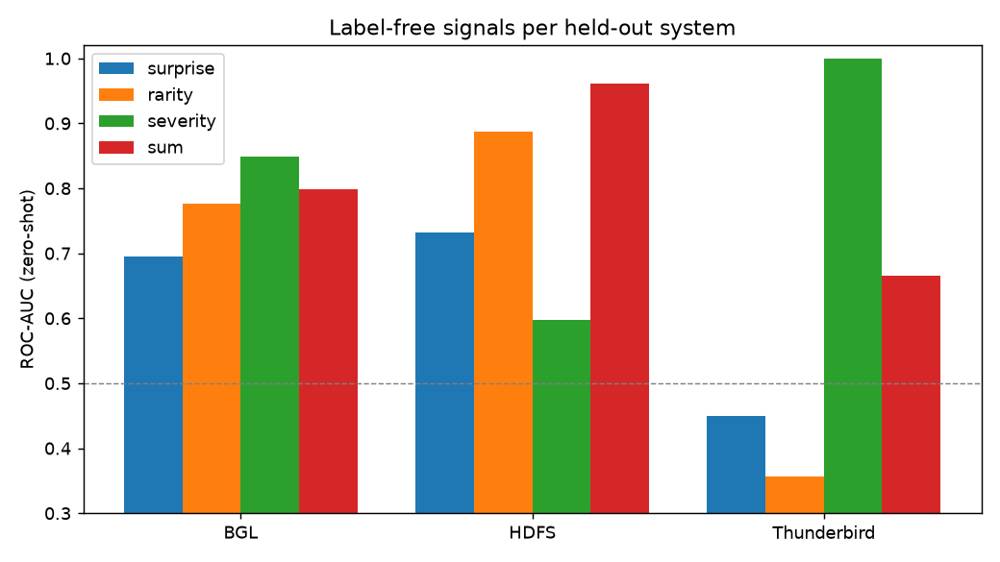
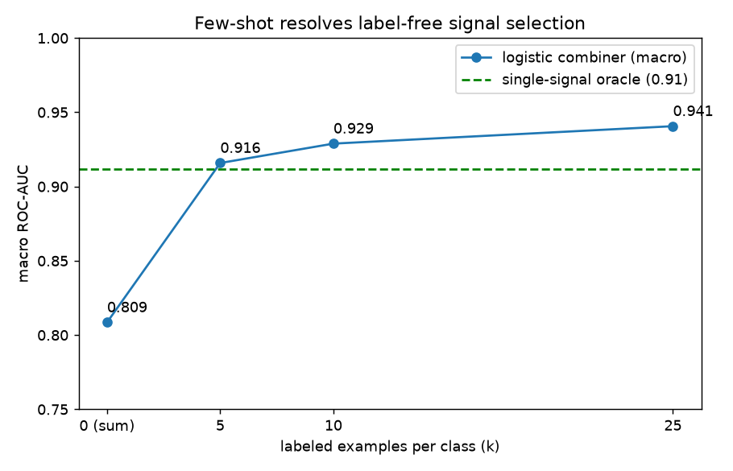

# Cross-System Zero-Shot Log Anomaly Detection

Log anomaly detection is usually trained and evaluated on a single system. This
project studies cross-system transfer under a **leave-one-system-out (LOSO)**
protocol: the detector is trained on a set of systems and evaluated on a held-out
system for which no labels are available.

> **Full write-up: [REPORT.md](REPORT.md).** Summary: zero-shot transfer degrades
> sharply, and a training-free template-rarity baseline outperforms the learned
> model on two of three held-out systems. Anomalies fall into a taxonomy
> (contextual, point, marked), each addressed by a distinct label-free signal
> (surprise, rarity, severity). Selecting the correct signal without labels is
> unsolved, but 5-25 labels per system recover it, reaching macro ROC 0.94. All
> experiments run on a single 8 GB GPU.

## Approach

Cross-system transfer fails when a model keys on system-specific *vocabulary*. To
avoid this, the pipeline never operates on raw tokens; it maps every log line to a
**shared semantic space** in which identical templates from different systems
coincide.

```
raw logs (N systems)
  -> Drain3 parse ............ templates ("Receiving block <*> src: <*>")
       -> frozen MiniLM embed . shared 384-d vectors (cross-system)
            -> group into sequences . (template-seq, label)
                 -> small causal transformer over embeddings
                      -> surprise (predicted vs actual next embedding) = score
```

The surprise signal is unsupervised, which is what allows a model trained on one
set of systems to score a system it has not seen.

## Design decisions

| Decision | Choice | Rationale |
|---|---|---|
| Granularity | Per-system cut, unified `(seq, label)` interface | HDFS uses block sessions (comparable to prior work); BGL, Thunderbird, and OpenStack use fixed-count windows |
| Window | 100 lines, stride 50 | line-count windows keep sequence lengths comparable across very different log rates |
| Embedder | `all-MiniLM-L6-v2`, frozen, cached | inexpensive on CPU, strong, and easy to swap for an ablation |
| Representation | embedding **regression**, not template-id classification | template ids are not shared across systems; the vector space is |
| Metric | PR-AUC (primary), ROC-AUC (secondary), macro-averaged | robust to widely varying anomaly base rates |

## Datasets

| System | Unit | Labels |
|---|---|---|
| HDFS  | block session | `anomaly_label.csv` (2.9% of 575k blocks anomalous) |
| BGL   | 100-line window | inline (`-` = normal) |
| Thunderbird | 100-line window | inline; first 5M-line slice (full file is 32 GB) |
| OpenStack | VM-instance session | 4 abnormal instance UUIDs in `anomaly_labels.txt` |

Additional unlabeled systems (Spark, Hadoop, Zookeeper, HPC, Apache, Linux,
OpenSSH, and others) can be added to the pretraining pool to improve
generalization.

## Pipeline

```
python src/parse.py    --system HDFS --input data/HDFS/HDFS.log --out out
python src/embed.py    --out out                       # build shared vector cache
python src/sequence.py --system HDFS --out out --hdfs-labels data/HDFS/anomaly_label.csv
python src/loso.py     --out out                       # train and evaluate, leave-one-system-out
```

Outputs are written to `out/<system>/` (`parsed.parquet`, `templates.csv`,
`sequences.npz`) and `out/embeddings/` (`vocab.parquet`, `vectors.npy`).

## Evaluation protocol

| Setting | Definition |
|---|---|
| Oracle | trained on the target system; upper bound |
| Naive transfer | trained on one system and applied directly to another |
| **LOSO zero-shot** | trained on all systems except the target, with no target labels |
| Few-shot | LOSO plus fine-tuning on k=10/50 target examples |

## Results

Each labeled system is held out in turn. Full tables and discussion are in
[REPORT.md](REPORT.md); the main findings follow. Figures are regenerated from the
saved `out/<system>/scores.npz` with `python src/plot_results.py --out out`.

No single label-free signal is best across systems: rarity is strongest on HDFS
(point anomalies), while semantic severity is strongest on BGL and Thunderbird
(textually marked alerts). An equal-weight sum is therefore diluted whenever it
mixes in the wrong signal.



| Held-out system | Best label-free signal | ROC-AUC |
|---|---|---|
| HDFS | rarity (point) | 0.89 |
| BGL | severity (marked) | 0.85 |
| Thunderbird | severity (marked) | 1.00 |

Surprise and rarity are complementary on HDFS (Spearman -0.03); their ensemble
reaches ROC 0.985.

Selecting the correct signal without labels is unsolved, but a small number of
labels resolves it. A logistic combiner over the three z-scored signals, given k
labeled examples per class, raises macro ROC from 0.81 (equal-weight sum) to 0.94
at k=25, exceeding the single-signal oracle (0.91).


